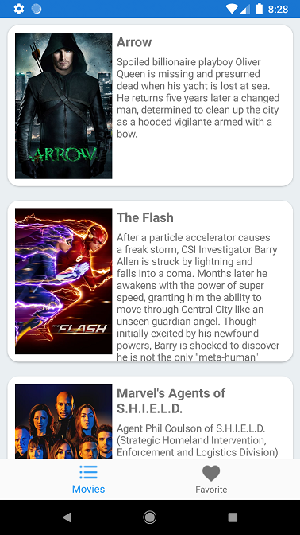

# CrossPlatformADV
 
- Arquitetura: DDD
- Integração com APP Center

## Camada de interface 

***CrossPlatform***
 Projeto responsavel por controlar navegação da tela e bindings de tela com MVVM

- Dependencias
  - Xamarin.Forms - recursos para plataforma hibrida
  - Prism.DryIoc.Forms - Gerenciamento de injeção de dependencia
  
***CrossPlatform.Android***
 Projeto cross platform responsavel pela interface nativa android
 
***CrossPlatform.iOS***
 Projeto cross platform responsavel pela interface nativa IOS
  
## Camada de Serviço

***CrossPlatform.Service***
 Projeto responsavel por prover os dados a interface e controlar acessos a API's.

- Dependencias
  - Refit - Automatização de chamadas REST.
  
## Camada de Dominio

***CrossPlatform.Domain***
 Projeto responsavel pelas entidades que representam o negocio, interfaces que devem ser nescessarias para o funcionamento da aplicação e configurações do aplicativo atraves do arquivo AppSettings.

## Camada de Infra-estrutura

 Camada responsavel por armazenar os dados local
 
***CrossPlatform.Infra.LiteDB***
 Projeto responsavel por salvar os dados localmente usando banco de dados não relacional.
 
- Dependencias
  - LiteDB
 
***CrossPlatform.Infra.SQLite***
 Projeto responsavel por salvar os dados localmente usando banco de dados relacional.
 
- Dependencias
  - SQLite-Net-PCL

### Screenshot 

